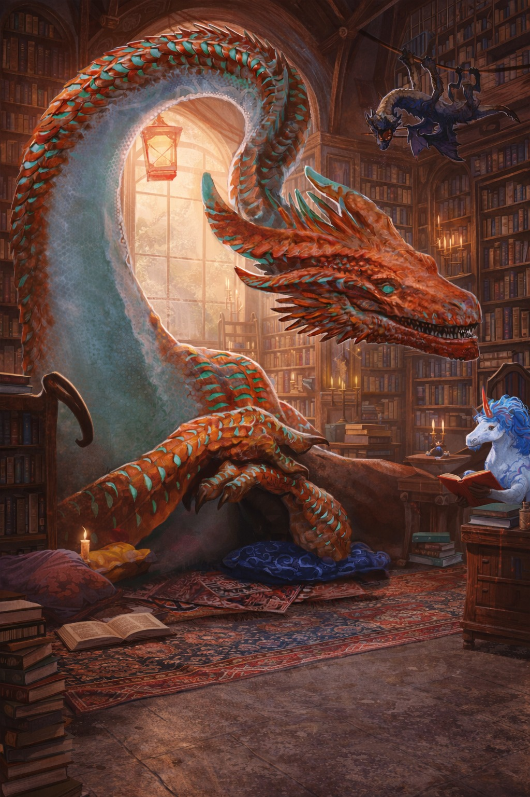
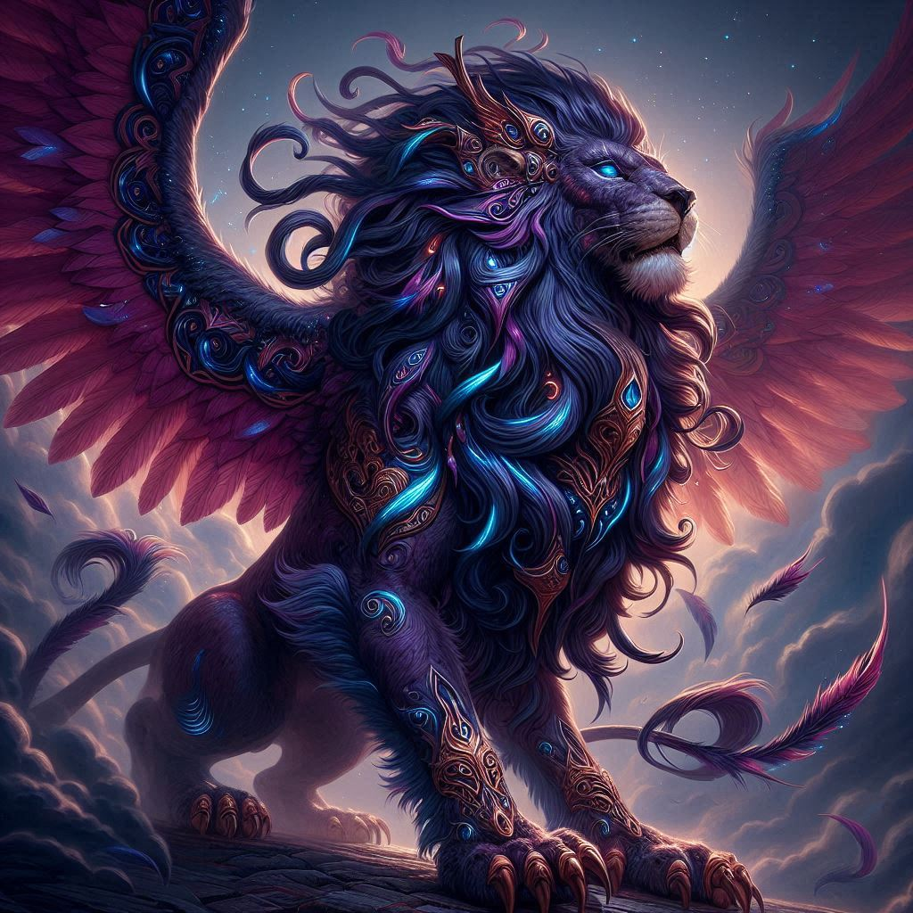
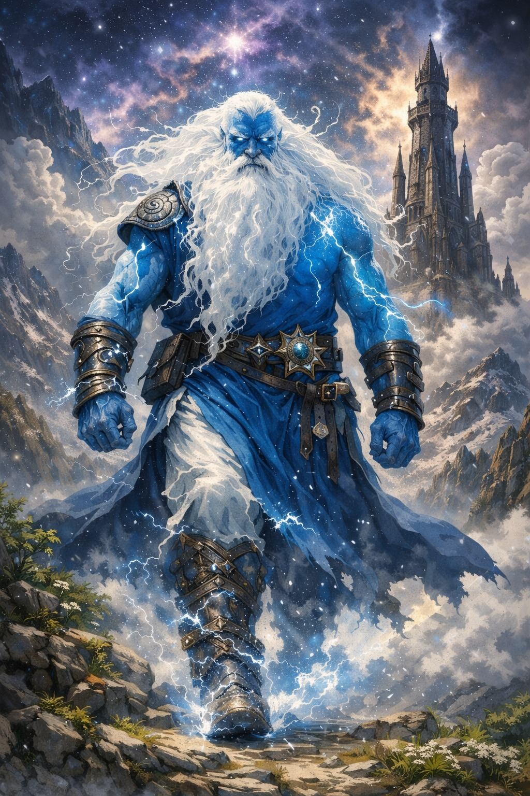

# A torre de marfim

## Regras de conduta e boa convivência

Este é um espaço coletivo de jogo, criado para que todos possam se divertir, contar histórias e evoluir seus personagens juntos. O respeito entre os participantes é parte fundamental da experiência.

Espera-se que todos os jogadores e mestres:

Tratem os demais com educação e respeito, dentro e fora do jogo.

Separem conflitos de personagem de conflitos pessoais. Problemas em jogo não devem virar desentendimentos fora dele.

Evitem comportamentos que prejudiquem a experiência dos outros, como interromper constantemente, desmerecer decisões de mesa ou criar discussões desnecessárias durante a sessão.

Lembrem que o RPG é cooperativo: a história é construída em grupo, e não existe “protagonista único”.

Diferenças de interpretação de regra podem acontecer. Nesses casos, a decisão final durante a sessão cabe ao mestre da mesa.

Atitudes tóxicas, desrespeitosas ou que prejudiquem o ambiente de jogo não são compatíveis com a proposta da campanha e podem levar a advertências ou outras medidas definidas pela organização.

O objetivo principal é simples: todo mundo deve sair da mesa tendo se divertido.

Em casos extremos podem ser aplicadas penalidades ou expulsões.

## Cenário e guilda

Para facilitar obtenção de materiais e que todos possam usar coisas comuns como base se usa o cenário de Forgotten Realms em Faerun.

A **guilda** está ligada a história e será evoluida nela, em grande parte pelos ideias dos jogadores, segundo regras de bastião da ed. 2024.

Terão missões e demais objetivos ligados ao desenvolvimento da campanha que se ligarão a guilda e seus guardiões.

## Nossos ideais ao mestrar

O mestre não é dono da história, apenas tem um papel diferente dos demais jogadores, mas assim como os jogadores não jogam sozinhos, o mestre também não joga sozinho. O RPG deve ser visto como uma narrativa que será construída em conjunto por todos que estão presentes, sendo que se busca a diversão conjunta de todos os participantes.

As regras de jogo e mecânicas de jogo, tanto desse guia quanto dos livros e materiais oficiais podem ser moldados pelo mestre e interpretados em jogo, sendo que o mestre tem a decisão em mãos, sempre se recomenda ter a diversão de todos jogadores em mente quando decidir algo factual em mesa.

Devido exatamente a diversão não se espera que tenham mortes de personagens roteirizadas. Sendo também desestimulado sessões completamente roteirizadas, pensando nas falas e ações de personagem que irão ocorrer dentro do jogo. Isso quebra a imersão, além de estragar a surpresa de jogo.

## Histórias e modelos de mesa

Essa será uma campanha de história única, com três mestres distintos fazendo cada um o papel de um guardão da guilda, além de fazer uso da mecânica de bastião presente no livro de 2024.

### Cobren - O Dragão de Cobre

  

 
Quando um desastres atinge uma região Cobren é o primeiro a chegar para oferecer o suporte necessário, ele também é o
primeiro a pegar uma fofoca no ar, uma informação aqui e outra ali. Ele utiliza de sua vasta rede de amigos para
garantir que ninguém fique sem ajuda. E vendo o crescimento dos problemas de Faêrun, ele se juntou a Grimthur e a
Spharion para pensar em formas de novos talentos crescerem pelo continente e desbravarem tudo o que Faêrun tem a
oferecer com espadas ou gracejos.

### Spharion - A Androesfinge

  

 

Spharion é a presença muitas vezes silenciona na sala, o guardião de verdades incômodas e de caminhos sem volta, ele observa mais do que fala — e quando fala, cada palavra pesa como um juramento antigo.

Sua postura é austera, o olhar implacável, é a justiça que impõe e não admite atalhos. Spharion mostra que decisões tem consequência, aplica desafios que testam caráter e combates que cobram estratégia. Não é a crueldade que o move, mas a convicção de que grandes indivíduos nascem quando o risco é real, pois ele são formados a ferro e fogo.

Spharion lapida as lendas com rigor e diante dele, heróis não pedem passagem, mas provam merecimento.

### Grimthûr - O Gigante da Tempestade

  

 
[pensar no texto]

### Jogadores

Para favorecer o balanço se recomenda que os jogadores da mesa estejam dentro de um range de nível que o mestre fornecer para a aventura, sendo desencorajado ter jogadores com menos de 2 níveis do estipulado, assim uma aventura de nível 6 não deveria ter jogadores abaixo do 4.

Isso ainda vai fazer com que os jogadores se adaptem melhor com o personagem, aprendam a usar melhor a ficha e seus recursos, principalmente jogadores iniciantes, que ao chegar no nível alto muito rápido terão dificuldades para realmente fazer diferença nas aventuras.

#### Imposto da Guilda

Ao final de cada missão, a guilda retém **10% de todo o ouro obtido pelo grupo** como taxa de manutenção, logística e funcionamento do Bastião.

Esse valor representa:

- Manutenção da estrutura da guilda
- Custos com suprimentos, contatos e informação
- Apoio indireto às missões dos aventureiros

O valor retido não pertence a nenhum personagem específico e não pode ser recuperado pelos jogadores.

---

#### Registro de Recursos

Para manter a organização e o equilíbrio da campanha, os mestres também manterão registro do:

- Ouro de cada personagem
- Itens relevantes carregados pelo personagem

Isso ajuda a evitar inconsistências, perdas de informação e abusos, além de facilitar o acompanhamento da progressão do grupo ao longo da campanha.

Os jogadores continuam responsáveis por suas fichas, mas os registros da equipe de mestres servem como referência oficial em caso de dúvida.

# O Bastião

O Bastião é um elemento central da campanha e seu progresso representa o avanço estrutural da guilda e da presença dos personagens no mundo.

**Evolução com Ouro**

O Bastião **não evolui utilizando XP dos personagens**.  
Toda melhoria, expansão, construção de novas áreas ou benefícios permanentes deve ser realizada **exclusivamente por meio de investimento em ouro**.

O crescimento do Bastião é um desenvolvimento coletivo da campanha, separado da progressão individual de nível dos personagens.

## Características do bastião

### Marco de Tempo Fixo

As melhorias do Bastião não acontecem imediatamente após o pagamento.  
A evolução ocorre apenas em um **marco de tempo fixo: domingo**.

Isso representa:

- Tempo de construção
- Organização da guilda
- Logística e mão de obra

Como se os lideres da guild parassem para atualizar a guild apenas no momeento certo.

### Taxa da Guilda Não Conta

Os **10% do ouro retidos pela guilda** ao final das missões **não podem ser usados** para evoluir o Bastião.

Apenas o ouro que realmente permanece disponível para os personagens e para investimento direto pode ser aplicado nas melhorias.

### Facilidades

As salas de facilidades seus efeitos e custos podem ser consultadas no livro de 2024.

### Subndo o nível do bastião

| Quantidade de Ouro | Nível | Quantidade de Ouro | Nível |
| ------------------ | ----- | ------------------ | ----- |
| 0                  | 1     | 85.000             | 11    |
| 300                | 2     | 100.000            | 12    |
| 900                | 3     | 120.000            | 13    |
| 2.700              | 4     | 140.000            | 14    |
| 6.500              | 5     | 165.000            | 15    |
| 14.000             | 6     | 195.000            | 16    |
| 23.000             | 7     | 225.000            | 17    |
| 34.000             | 8     | 265.000            | 18    |
| 48.000             | 9     | 305.000            | 19    |
| 64.000             | 10    | 355.000            | 20    |

### Itens Mágicos do Bastião

Os líderes da guilda pode emprestar itens mágicos que serão disponibilizados para missões e **não pertencem aos personagens**, mas sim ao Bastião.

Eles são considerados recursos da guilda, emprestados aos aventureiros conforme a necessidade da missão.

#### Propriedade do Bastião

Todo item mágico concedido para uma missão é um **empréstimo oficial**.  
O personagem pode utilizá-lo durante a aventura, mas ele deve ser devolvido ao final.

O item faz parte do patrimônio da guilda e pode ser redistribuído para outras missões no futuro.

#### Penalidade por Não Devolver

Se um personagem **se recusar a devolver** um item mágico, o Bastião drena sua energia vital para compensar a perda.

Isso se reflete em **perda de XP**, representando o esforço da guilda para recriar, substituir ou compensar o item perdido.

A quantidade de XP perdida pode variar conforme a raridade do item, de acordo com a decisão do mestre.

obs: apenas será punido o jogador que se usar da má fé

#### Itens Perdidos ou Roubados

Se um item mágico for perdido, destruído ou roubado durante a missão, ele **não retorna automaticamente ao Bastião**.

A perda é considerada real dentro da narrativa e afeta os recursos da guilda.

#### Recuperação Narrativa

Um item perdido pode ser recuperado caso o encontrem de novo.

Isso pode acontecer por meio de:

- Missões de recuperação
- Negociação
- Investigação
- Confronto com quem estiver com o item

A recuperação depende da história e das ações dos personagens, não sendo automática.
O mestre tem liberdade de dar chances ou não da recuperação

# Criação de personagem

Jogar 4d6 para cada status de personagem, para cada status desconsidere o menor resultado e some os três maiores.
Some todos os valores dos 6 atributos, se não for igual ou superior a 74 desconsidere a rolagem. Faça isso até obter duas rolagem com valores iguais ou superiores a 74, e então escolha uma delas para usar.

No servidor é possível usar !randchar duas vezes.

Obs: É possível usar a compra de pontos do livro oficial do D&D 2024 também.

Obs²: Ao montar um personagem ao executar uma rolagem para personagem se deve anunciar que está fazendo rolagens para criar um novo personagem e deve ter pelo menos um mestre junto para comprovar isso.

## Sem Multiclasse

Personagens não podem realizar multiclasse.  
Cada personagem seguirá apenas uma classe do nível 1 ao 20.

Essa decisão existe para:

- Manter o equilíbrio entre jogadores
- Evitar combinações excessivamente fortes
- Facilitar o controle de poder nas mesas
- Ajudar jogadores iniciantes a dominarem melhor seus recursos

## Livros Oficiais Liberados

Todo conteúdo publicado oficialmente para D&D está liberado.

Isso inclui:

- Classes
- Raças / Espécies
- Talentos
- Magias
- Subclasses
- Equipamentos

O material deve ser oficial — sem adaptações externas.

obs: magias e recursos que foram reprintados na ed. 2024 são o que valem em detrerimento a ed. 2014.

## Sem Homebrew

Conteúdos criados por fãs, adaptações da internet ou materiais não oficiais **não são permitidos**.

Isso garante:

- Equilíbrio entre personagens
- Clareza de regras
- Padronização entre diferentes mestres

## Personalização de Origem Liberada

A personalização de origem apresentada nos livros oficiais é permitida.

Isso inclui ajustes como:

- Distribuição de bônus de atributo
- Proficiências
- Idiomas

Desde que siga as regras oficiais, o jogador pode adaptar sua origem ao conceito do personagem.

### Ligação obrigatória com a Guilda

Todo personagem criado para o cenário **deve ter em sua história pessoal um motivo claro para procurar, ingressar ou já ter ligação com uma guilda**.

A campanha gira em torno da guilda e das missões associadas a ela, então os personagens não são aventureiros aleatórios: eles fazem parte de uma estrutura maior.

A história pode incluir, por exemplo:

- Busca por trabalho ou estabilidade
- Interesse em conhecimento, poder ou treinamento
- Dívida, favor ou obrigação com a guilda
- Recomendação de um membro antigo
- Desejo de fama, reconhecimento ou propósito
- Refúgio após algum evento marcante do passado

O importante é que o personagem **tenha um motivo narrativo para aceitar missões e cooperar com a organização**.

Personagens cuja história não se encaixe nesse conceito poderão ser ajustados junto ao mestre antes de entrarem em jogo.

## Tipo de personagem

A campanha pede personagens que queiram ou procuram enfrentar desafios clássicos de uma fantasia medieval. Será mais divertido e proveitoso se ao criar um personagem ele tenha entre a história ou caracteristicas uma busca ou ideal que seja condizente com isso.

## Uso das Regras 2024

A campanha adota oficialmente as regras atualizadas de 2024 como base do sistema.

Isso afeta:

- Criação de personagem
- Talentos
- Bastião
- Mecânicas revisadas de jogo

Caso haja conflito entre material antigo e as regras 2024, a versão mais recente tem prioridade.

## Conceito de aposentadoria

Cada pllayer pode ter apenas um personagem ativo no cenário, em caso de não estar satisfeito com o mesmo é poossível aposentar ele para criar outro personagem.
Tenha em mente que ao fazer isso o personagem não pode mais ser usado, o mesmo pode ser aproveitado pelo mestre como npc, ou podem descrever o que aconteceu com ele com liberdade.
E ao fazer isso não ganhará nenhum xp ou nada dos itens daquele personagem, e deverá começar outro segundo as regrras de criação.

# Regras da casa

## Cicatrizes

Quando o personagem sofrer um golpe crítico ele também terá cicatriz permanente no lugar que sofreu o golpe, para representar a força do golpe sofrido.

### Críticos maximizados

Ao acertar um crítico a regra oficial diz que se rola os dados de dano duas vezes.

Mas vamos imaginar um golpe de espada que tiraria `1d10 + mod de força`, que vamos considerar 5 aqui.

Num crítico normal seria: `2d10+5`

Isso corre o risco de tirar dois números baixos, como um 1 e um 2, tendo então, `1+2+5` ou um total de 8 de dano causado. Isso faz com que o critico nem sempre seja uma coisa impactante, aquém da probabilidade de acertar isso no dado.

Para privilegiar os acertos críticos adotamos um critico além do dano real, usamos o maximizado. Ou seja, ao acertar um critico você causa o máximo de dano que pode causar em uma rolagem de dano e rola novamente.

Na mesma situação de antes `1d10 + mod de força (5)` teríamos um dano de `1d10+5+10`, em que o 10 é o máximo de dano que esse ataque poderia causar na rolagem do d10.

Mesmo tirando um 1 na rolagem, ainda seria `1+5+10` obtendo um total de 16 de dano causado. Dessa forma sempre que um acerto critico ocorrer ele terá impacto.

Perceba que dessa forma o dano causado será mais brutal. Porém o mesmo valor para monstros, tornando monstros chefes mais assustadores, principalmente de enfrentar eles em terrenos vantajosos para eles, trazendo uma tonalidade de realidade e perigo para um combate, causar um critico ou levar um pode mudar completamente o rumo de um combate.

### Talentos modelo 2024

Se ao pegar um talento ele não der um ponto de status será adotado que ele dará um ponto de atributo, para decidir qual, se deve alinhar qual atributo ou opções de atributos fazem mais sentido para aquele talento.

### Regras de dados contra a morte

Queda a 0 Pontos de Vida

Quando um personagem cai a 0 PV e começa a realizar testes de morte, as falhas obtidas nesses testes deixam marcas duradouras.

Mesmo que o personagem seja estabilizado ou curado, as falhas em death saves já acumuladas não são apagadas. Elas permanecem registradas até que o personagem complete um descanso longo.

Isso significa que cair várias vezes em combate torna a situação progressivamente mais perigosa, reforçando o peso das decisões e o risco de permanecer na linha de frente quando já se está ferido.

Essa regra também pode se aplicar a NPCs importantes, a critério do mestre.

### Poções

Poções de cura não utilizam valores fixos e não são maximizados ao tomar com ação.
Sempre que uma poção for usada, seus dados de cura devem ser rolados normalmente.

Isso mantém a incerteza do combate e evita curas sempre previsíveis.
